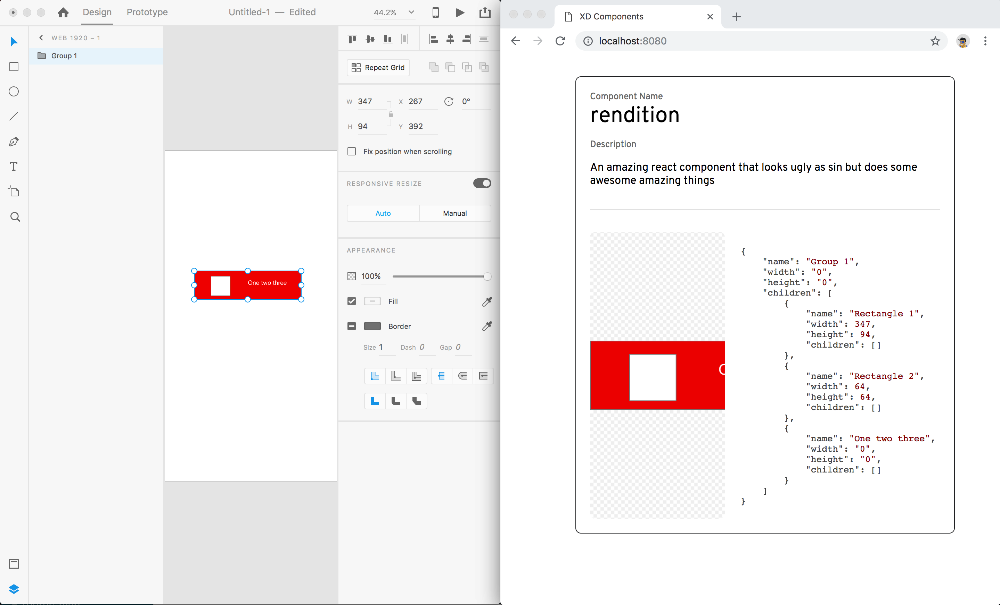

# Adobe XD Plugin Experiment

Challenge project created as an experiment to code an Adobe XD plugin in an hour from pulling down the plugin API to modifying it

This is a dead simple plugin that is a variance of the Export plugin. It drops an image along with metadata from a `SceneNode` in the `src/imgs` folder

To install:

1. Install Adobe XD
1. Add Plugin to plugin folder
1. `npm install` under server directory
1. `npm run start`